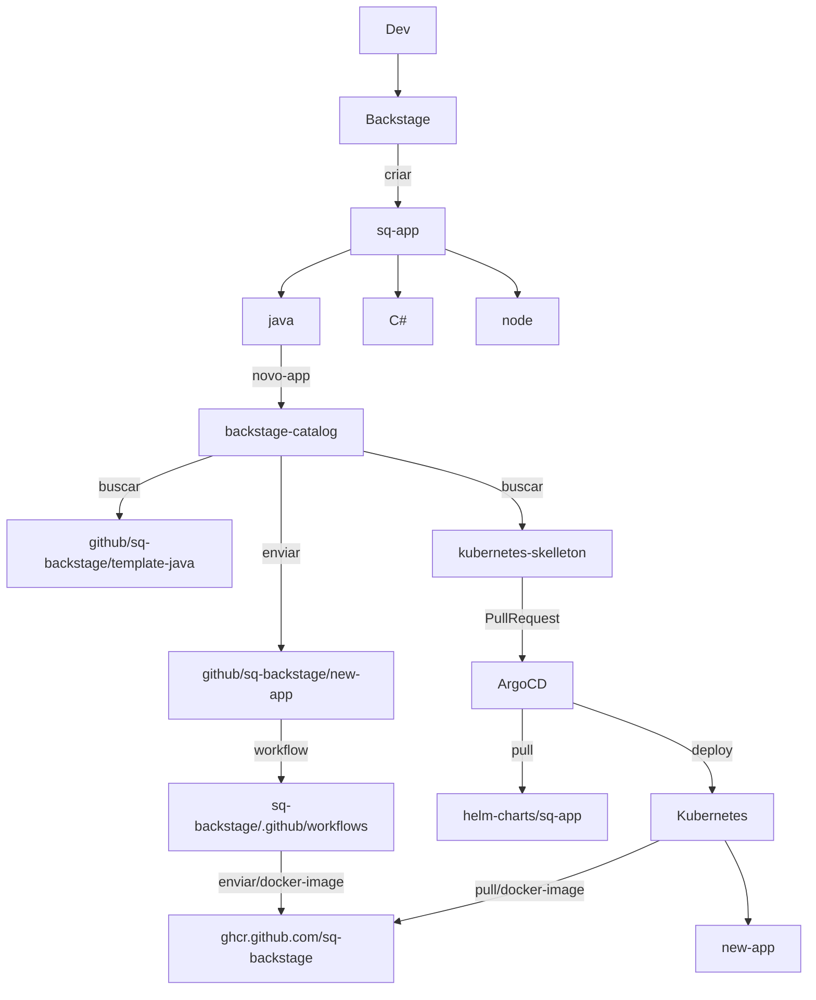

# Odin Poc

## Backstage - IDP

### Ambientes necessários antes de começar


## Deploy Backstage

Gere um token de acesso do GitHub aqui

### Permissões Necessárias:

#### Leitura de componentes de software:
- `repo`

#### Leitura de dados da organização:
- `read:org`
- `read:user`
- `user:email`

#### Publicação de templates de software:
- `repo`
- `workflow` (se os templates incluírem workflows do GitHub)


| Nome                      | Onde obter?                                                                                                     |
| :------------------------ | :-------------------------------------------------------------------------------------------------------------- |
| GITHUB_ACCESS_TOKEN       | Gerar um novo token de acesso pessoal em [página de segurança do GitHub](https://github.com/settings/tokens)    |
| AUTH_GITHUB_CLIENT_ID     | Obter em [ID do aplicativo GitHub](https://github.com/organizations/CoE-Sinqia/settings/applications/new)   |
| AUTH_GITHUB_CLIENT_SECRET | Abrir um ticket para SQ para compartilhar esse valor                                                         |
| SONARQUBE_TOKEN           | Criar um token `Sonarqube` usando esta [documentação](https://docs.sonarqube.org/latest/user-guide/user-token/) |

Todos os ambientes acima `DEVEM` ser exportados no contexto do seu bash da seguinte forma:

```sh
# .bashrc ou .zshrc
export GITHUB_ACCESS_TOKEN='SEU-TOKEN-GITHUB'
export AUTH_GITHUB_CLIENT_ID='SEU-CLIENT-ID'
export AUTH_GITHUB_CLIENT_SECRET='SEU-CLIENT-SECRET'
export SONARQUBE_TOKEN='SEU-TOKEN-SONARQUBE'
```

### Configurando seus hosts

Você precisará criar uma entrada no seu `/etc/hosts` para especificar `backstage.local` da seguinte forma:

```sh
# /etc/hosts

# ...
127.0.0.1 backstage.local
# ...
```

Certifique-se de executar o comando acima com privilégios de superusuário.

### 🚀 Iniciando o projeto

Você precisará ter o `Docker` e o `docker-compose` instalados antes de continuar!

Assim que tudo o que você precisa estiver no contexto do seu bash, execute os comandos abaixo:

```sh
docker-compose run --rm app yarn # para instalar os node_modules
docker-compose up -d app # para iniciar a aplicação do Backstage
```

O Backstage no modo de desenvolvimento estará disponível em <http://backstage.local:3000> e está usando a integração `GitHub SSO`.

### 🆙 Atualizando o Backstage

```sh
docker-compose run --rm app bash
yarn backstage-cli versions:bump
```

### 🚦 Fluxo de trabalho



### 🧩 Referências 

- [GitHub](https://github.com)
- [Backstage](https://backstage.io/)
- [Kubernetes](https://kubernetes.io/)
- [Terraform](https://www.terraform.io/)
- [Prometheus](https://prometheus.io/)
- [Jaeger](https://www.jaegertracing.io/)
- [Grafana](https://grafana.com/)

### ✨ Contribuições

Nós ❤️ contribuições grandes ou pequenas. [Veja nosso guia](contributing.md) sobre como começar.

### Agradecimentos a todos os nossos colaboradores!

<!-- <a href="https://github.com/your-repo/contributors">
  
</a> -->

Feito com 💜 pelo Time de COE - SINQIA